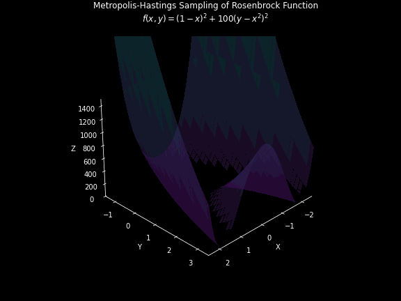

# Metropolis-Hastings Visualization

This project provides a 3D visualization of the Metropolis-Hastings algorithm sampling from the Rosenbrock function (also known as the banana function). The visualization shows how the algorithm explores the function's characteristic valley and converges towards its global minimum.

## The Rosenbrock Function

